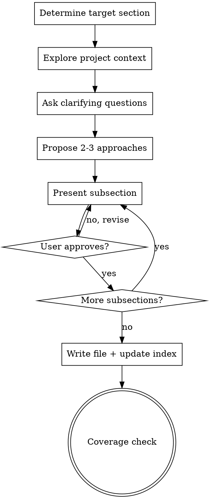

# Business Rule Builder

Build detailed, implementation-ready business rule sections for Reconova by expanding the original archived rules through structured collaborative brainstorming.

<HARD-GATE>
Do NOT write any section file until you have presented the complete design subsection by subsection and the user has approved EVERY subsection. This applies to EVERY section regardless of perceived simplicity. No shortcuts. No "this section is straightforward enough to just write."
</HARD-GATE>

---

## Anti-Patterns

Every section goes through the full process. "Simple" sections are where unexamined assumptions cause the most wasted work.

| Thought | Reality |
|---------|---------|
| "This section is simple, I'll just write it" | Simple sections hide edge cases. Follow the process. |
| "I already know what the user wants" | You know the original rules. The expansion needs user input. |
| "Let me ask 5 questions at once to save time" | One question per message. Multiple questions overwhelm. |
| "I'll skip the structure proposal — it's obvious" | Always propose 2-3 approaches. The user may see it differently. |
| "Let me present the whole design at once" | Subsection by subsection. Get approval incrementally. |
| "This edge case is unlikely, I'll skip it" | Document it. Unlikely != impossible. |
| "I'll add a nice-to-have feature the original didn't mention" | YAGNI. Only expand what exists. Don't invent new requirements. |
| "The original rule is unclear, I'll interpret it myself" | Ask the user. Ambiguity = question, not assumption. |

---

## Context

**Source of truth (original rules):** `docs/plans/business-rule-archived.md` — 135 rules across 10 domains.
**Output directory:** `docs/plans/business-rules/` — one file per section.
**Index file:** `docs/plans/business-rules/00-index.md` — tracks section status.
**PRD reference:** `docs/plans/2026-03-01-reconova-prd-design.md`
**Implementation plan reference:** `docs/plans/2026-03-01-reconova-implementation-plan.md`

### Section Map

| # | File | Original Rules |
|---|------|---------------|
| 1 | `01-authentication-account-security.md` | BR-AUTH-001 to BR-AUTH-015 |
| 2 | `02-tenant-management.md` | BR-TNT-001 to BR-TNT-014 |
| 3 | `03-billing-credits.md` | BR-BILL-001 to BR-BILL-018 |
| 4 | `04-scanning-workflows.md` | BR-SCAN-001 to BR-SCAN-021 |
| 5 | `05-feature-flags-access-control.md` | BR-FLAG-001 to BR-FLAG-007 |
| 6 | `06-compliance-engine.md` | BR-COMP-001 to BR-COMP-011 |
| 7 | `07-cve-monitoring.md` | BR-CVE-001 to BR-CVE-008 |
| 8 | `08-integrations.md` | BR-INT-001 to BR-INT-012 |
| 9 | `09-super-admin-operations.md` | BR-ADM-001 to BR-ADM-010 |
| 10 | `10-data-audit-platform-compliance.md` | BR-DATA-001 to BR-DATA-019 |
| 11 | `11-system-configuration.md` | Cross-cutting config reference |
| 12 | `12-error-response-schema.md` | Shared error JSON format |
| 13 | `13-version-history.md` | Change log |

---

## Process

This is a **rigid skill** — follow these steps exactly in order. Do not skip steps or combine them.

You MUST create a task (using TaskCreate) for each step and complete them in order.



### Step 1: Determine Target Section

- If the user provides a section number or name, use that.
- Read `docs/plans/business-rules/00-index.md` to check current status.
- If the section is already marked "Done", confirm with the user before overwriting.
- Read the corresponding original rules from `docs/plans/business-rule-archived.md`.

### Step 2: Explore Context

Use an Explore agent to gather context. Check all of the following:
- The original rules for this section from `business-rule-archived.md`.
- The PRD (`2026-03-01-reconova-prd-design.md`) for relevant schema and design decisions.
- The implementation plan (`2026-03-01-reconova-implementation-plan.md`) for planned files and APIs.
- Already-completed business rule sections in `docs/plans/business-rules/` for cross-references and established conventions (enum casing, algorithm format, table structure, field naming).
- Report findings to inform brainstorming.

### Step 3: Clarifying Questions

Ask the user **one question at a time** using `AskUserQuestion`.

**Rules:**
- Only one question per message. If a topic needs more exploration, break it into multiple questions.
- Prefer multiple-choice questions when possible — easier to answer than open-ended.
- Open-ended is fine when the choices aren't clear enough to enumerate.
- Focus on understanding: ambiguities in original rules, design decisions not covered (state machines, field constraints, algorithms), non-obvious edge cases, scope boundaries (what's MVP vs post-MVP).
- Stop asking when you have enough clarity to propose structure (typically 3-6 questions).
- Do NOT ask questions you can answer by reading existing completed sections or project docs.

### Step 4: Propose Structure

Propose 2-3 structural approaches for organizing the section's subsections.

**Rules:**
- Present options conversationally with your recommendation and reasoning.
- Lead with your recommended option and explain why.
- Include: what subsections to include, how to group related rules, trade-offs.
- Ask the user to pick using `AskUserQuestion`.

### Step 5: Present Design Subsection by Subsection

For each subsection, present the content and ask the user to approve before moving on.

**Rules:**
- Scale each subsection to its complexity: a brief table if straightforward, detailed algorithm if nuanced.
- After presenting each subsection, ask: "Does this look right? Continue or need changes?"
- If the user says "need changes", incorporate feedback and re-present that subsection.
- If the user provides feedback alongside approval (e.g., "yes but change X"), note it and apply when writing.
- Be ready to go back to earlier subsections if something doesn't make sense in light of later ones.

**Typical subsections to consider** (adapt per section — not all apply to every section):

- **Entity States** — state machine with status values and meanings
- **State Transitions** — from/to/trigger/who table + ASCII diagram
- **Field Constraints** — every field with type and constraints for all relevant tables
- **Algorithms** — step-by-step pseudocode for key business logic flows
- **Permissions Matrix** — who can do what (`TENANT_OWNER` vs `SUPER_ADMIN`)
- **Edge Cases** — comprehensive table of non-happy-path scenarios with explicit behavior
- **Error Codes** — code, HTTP status, message, cause

### Step 6: Write the File

Once ALL subsections are approved:

1. Write the section file to `docs/plans/business-rules/{NN}-{slug}.md`.
2. Update `docs/plans/business-rules/00-index.md` to mark the section as "Done".
3. Present a **coverage check** table showing each original rule ID and where it's covered in the new document:

```
| Original Rule | Covered In |
|---|---|
| BR-XXX-001 Rule name | §N.M Subsection Name |
| BR-XXX-002 Rule name | §N.M Subsection Name |
```

---

## Key Principles

- **One question at a time** — Don't overwhelm with multiple questions per message.
- **Multiple choice preferred** — Easier to answer than open-ended when possible.
- **YAGNI ruthlessly** — Do not invent new rules or requirements. Only expand what exists in the original.
- **Explore alternatives** — Always propose 2-3 approaches before settling on structure.
- **Incremental validation** — Present design subsection by subsection, get approval before moving on.
- **Be flexible** — Go back and clarify if something doesn't make sense in light of new information.
- **Ambiguity = question** — When original rules are unclear, ask the user. Never assume.
- **Consistency over creativity** — Follow established conventions from completed sections exactly.
- **Explicit over implicit** — Edge case behavior must say what the system does, never "handle appropriately."

---

## Conventions

Follow these conventions established in Section 1. **Consistency across sections is critical.**

### Enum Values
All status/state values are **UPPERCASE**: `ACTIVE`, `SUSPENDED`, `PENDING_2FA`, `QUEUED`, etc.

### Role Names
`TENANT_OWNER`, `SUPER_ADMIN` — uppercase.

### Algorithm Format
```
BR-{DOMAIN}-{NNN}: Algorithm Name
──────────────────────────────────
Input: param1, param2

1. STEP description
   IF condition → REJECT "ERR_{DOMAIN}_{NNN}"
2. NEXT STEP
   ...
```

### State Transition Tables
| From | To | Trigger | Who | Side Effects |
|------|----|---------|-----|-------------|
Include "Side Effects" column when state changes cause cascading actions.

### Field Constraint Tables
| Field | Type | Constraints |
|-------|------|------------|
Always specify: nullability, defaults, immutability, max length, format, uniqueness, foreign keys.

### Edge Case Tables
| Scenario | Behavior |
|----------|----------|
Be explicit about what the system does — never say "handle appropriately".

### Error Code Tables
| Code | HTTP | Message | Cause |
|------|------|---------|-------|
Error codes follow pattern `ERR_{DOMAIN}_{NNN}`. Start numbering at 001 per domain.
User-facing messages should be clear and actionable. Do not leak internal state.

### Section File Header
Each section file starts with:
```markdown
# {N}. {Section Title}

> Covers: BR-{DOMAIN}-{NNN} through BR-{DOMAIN}-{NNN} from the original business rules.
> Error response JSON schema is defined in `00-index.md` Section 12 reference.
```

### Post-MVP Features
Mark post-MVP features inline: `[POST-MVP]` prefix in algorithms, `(post-MVP)` suffix in tables. Include them in the document with reserved error codes to avoid renumbering later.

### Cross-References
When referencing another section's rule or algorithm, use the format: `BR-{DOMAIN}-{NNN}` or `§{N}.{M} {Subsection Name}`.

---

## Quality Checklist

Before completing a section, verify:

- [ ] Every original rule (BR-*) from the archived doc is covered
- [ ] No rules were dropped or weakened without explicit user approval
- [ ] All enum values are UPPERCASE
- [ ] All algorithms have numbered steps with clear REJECT/RETURN paths
- [ ] All field constraints specify type, nullability, and key constraints
- [ ] Edge cases cover: race conditions, concurrent operations, state conflicts, cross-domain interactions
- [ ] Error codes don't conflict with codes from other completed sections
- [ ] Coverage check table is presented to user showing original rule → new location mapping
- [ ] Conventions match completed sections (check enum casing, table formats, header format)
