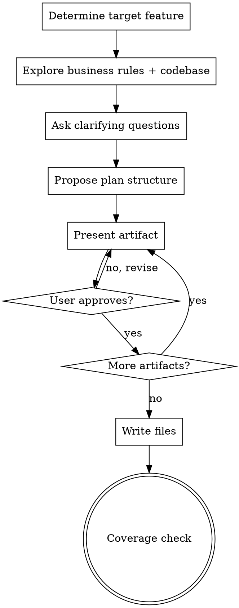

# Frontend Plan Builder

Transform business rules into comprehensive, implementation-ready frontend plans by producing a structured set of artifacts: README overview, implementation guide, screens & wireframes, user flows, and reference docs.

<HARD-GATE>
Do NOT write any plan file until you have presented the complete design artifact by artifact and the user has approved EVERY artifact. This applies to EVERY feature regardless of perceived simplicity. No shortcuts. No "this feature is straightforward enough to just write."
</HARD-GATE>

---

## Anti-Patterns

Every feature goes through the full process. "Simple" features are where unexamined UX assumptions cause the most wasted work.

| Thought | Reality |
|---------|---------|
| "This feature is simple, I'll just write the plan" | Simple features hide UX edge cases. Follow the process. |
| "I already know what screens are needed" | You know the business rules. The UX needs user input. |
| "Let me ask 5 questions at once to save time" | One question per message. Multiple questions overwhelm. |
| "I'll skip the structure proposal — it's obvious" | Always propose 2-3 approaches. The user may see it differently. |
| "Let me present all artifacts at once" | Artifact by artifact. Get approval incrementally. |
| "This error state is unlikely, I'll skip it" | Document it. Users will hit it. |
| "I'll add a nice-to-have screen the rules didn't mention" | YAGNI. Only plan what the business rules require. |
| "The business rule is unclear, I'll interpret it myself" | Ask the user. Ambiguity = question, not assumption. |
| "I'll just copy the backend use case format" | Frontend plans need UX-first thinking: screens, flows, states. |

---

## Context

**Business rules source:** `docs/plans/business-rules/` — one file per domain section.
**Business rules index:** `docs/plans/business-rules/00-index.md` — tracks section status.
**PRD reference:** `docs/plans/2026-03-01-reconova-prd-design.md`
**Implementation plan reference:** `docs/plans/2026-03-01-reconova-implementation-plan.md`
**Output directory:** `docs/frontend-plans/` — organized by feature/domain.

### Output Structure

Each frontend plan produces up to 5 artifacts in a feature directory:

```
docs/frontend-plans/{feature-slug}/
├── README.md                  # Overview, use case coverage, state machines, navigation map
├── implementation-guide.md    # State management, API integration, component architecture
├── screens-wireframes.md      # ASCII wireframes for every screen state
├── user-flows.md              # User journey flowcharts, branching logic, state transitions
└── reference.md               # Error handling matrix, validation rules, security considerations
```

For small features (single screen, few states), artifacts may be combined into fewer files — propose this in Step 4.

### Business Rules → Frontend Plan Section Map

| BR Section | Potential Frontend Domain |
|---|---|
| `01-authentication-account-security.md` | Auth flows, login, registration, MFA, password management |
| `02-tenant-management.md` | Tenant onboarding, settings, member management |
| `03-billing-credits.md` | Billing dashboard, credit purchase, usage display, invoices |
| `04-scanning-workflows.md` | Scan initiation, progress, results, history |
| `05-feature-flags-access-control.md` | Feature gating UI, plan-based access, upgrade prompts |
| `06-compliance-engine.md` | Compliance dashboard, policy management, reports |
| `07-cve-monitoring.md` | CVE alerts, vulnerability details, remediation tracking |
| `08-integrations.md` | Integration setup, webhook config, status monitoring |
| `09-super-admin-operations.md` | Admin panel, tenant management, system operations |
| `10-data-audit-platform-compliance.md` | Audit logs, data export, retention settings |
| `11-system-configuration.md` | System settings, config management |

---

## Process

This is a **rigid skill** — follow these steps exactly in order. Do not skip steps or combine them.

You MUST create a task (using TaskCreate) for each step and complete them in order.



### Step 1: Determine Target Feature

- If the user provides a section number, feature name, or domain, use that.
- Read `docs/plans/business-rules/00-index.md` to find the relevant business rule section.
- Check if `docs/frontend-plans/` already has a plan for this feature. If so, confirm with the user before overwriting.
- Identify the scope: is this a full domain (e.g., all of billing) or a specific feature (e.g., credit purchase flow)?

### Step 2: Explore Context

Use an Explore agent to gather context. Check all of the following:

- The relevant business rule section(s) from `docs/plans/business-rules/`.
- The PRD (`2026-03-01-reconova-prd-design.md`) for UI/UX design decisions, user personas, screen descriptions.
- The implementation plan (`2026-03-01-reconova-implementation-plan.md`) for planned frontend files, routes, and components.
- Any existing frontend plans in `docs/frontend-plans/` for cross-references and established conventions.
- The existing codebase (if any frontend code exists) to understand current patterns: routing, state management, component library, API patterns.
- Report findings to inform brainstorming.

### Step 3: Clarifying Questions

Ask the user **one question at a time** using `AskUserQuestion`.

**Rules:**
- Only one question per message.
- Prefer multiple-choice questions when possible.
- Focus on understanding:
  - **User personas**: Who uses this feature? What roles/permissions?
  - **Navigation context**: Where does this feature live in the app? How do users get here?
  - **Key UX decisions**: Modals vs pages? Inline editing vs form pages? Real-time vs polling?
  - **Platform targets**: Web only? Mobile responsive? Native app considerations?
  - **Design system**: Existing component library? Design tokens? Brand guidelines?
  - **State complexity**: Optimistic updates? Offline support? Multi-step wizards?
  - **Scope boundaries**: What's MVP vs post-MVP for the frontend?
- Stop asking when you have enough clarity to propose structure (typically 3-8 questions).
- Do NOT ask questions you can answer by reading existing business rules or project docs.

### Step 4: Propose Plan Structure

Propose 2-3 structural approaches for organizing the frontend plan.

**Rules:**
- Present options conversationally with your recommendation and reasoning.
- Lead with your recommended option and explain why.
- Include:
  - Which artifacts to produce (all 5 or a subset for simpler features).
  - How to scope screens and flows (by user role? by feature area? by use case?).
  - Whether to split into subdomain directories (like `payment/`, `wallet-billing/`).
  - Trade-offs between detail and brevity.
- Ask the user to pick using `AskUserQuestion`.

### Step 5: Present Design Artifact by Artifact

For each artifact, present the content and ask the user to approve before moving on.

**Rules:**
- Present artifacts in this order (each builds on the previous):
  1. **README.md** (overview) — sets the foundation
  2. **user-flows.md** — establishes behavior before UI
  3. **screens-wireframes.md** — visualizes the flows
  4. **implementation-guide.md** — technical details
  5. **reference.md** — error handling and validation
- After presenting each artifact, ask: "Does this look right? Continue or need changes?"
- If the user says "need changes", incorporate feedback and re-present that artifact.
- Be ready to go back to earlier artifacts if something doesn't make sense in light of later ones.

---

## Artifact Specifications

### README.md — Overview & Index

**Purpose:** Master reference and entry point for the frontend plan.

**Must include:**
- **Documentation index table** linking all artifacts with descriptions and audience.
- **Use case coverage matrix** mapping business rule IDs (BR-XXX-NNN) to frontend features.
- **User roles/personas** involved in this feature with their permissions.
- **State machine visualization** (ASCII) showing all states and transitions relevant to the feature.
- **State transitions table**: Current State | Action | Next State | Conditions.
- **Screen navigation map** (ASCII) showing how screens connect.
- **Document version and last updated date.**
- **"Based On" reference** linking back to the source business rule section(s).

### user-flows.md — User Journey Specifications

**Purpose:** Define exactly what happens step by step for each user action.

**Must include:**
- **Preconditions** for the feature (auth state, permissions, data requirements).
- **Flow diagrams** (ASCII) for each major user journey:
  ```
  [Screen/Action] → tap "Button Label"
      │ (analytics event name)
      ▼
  Check condition
      ├─ Success → next step → result
      └─ Failure → error handling → recovery action
  ```
- **Branching logic** showing which path users take based on conditions (role, state, feature flags).
- **Edge cases** documented inline: API error → toast + retry CTA.
- **Navigation/state reset behavior** when users switch context.
- **Analytics events** (event name, parameters, when fired).

### screens-wireframes.md — UI Specifications

**Purpose:** Visual layout specs for every screen state.

**Must include:**
- **Route structure** listing all routes (public, authenticated, admin).
- **ASCII wireframes** for each screen using box-drawing characters:
  ```
  ┌──────────────────────────────────────────────────────────────┐
  │ Header / Breadcrumb                                          │
  ├──────────────────────────────────────────────────────────────┤
  │ Content Area                                                 │
  │  • Component description                                     │
  │  • CTA: [Button Label]                                       │
  │  • Loading state: spinner + "Loading..."                     │
  ├──────────────────────────────────────────────────────────────┤
  │ Sidebar / Secondary content                                  │
  └──────────────────────────────────────────────────────────────┘
  ```
- **Screen states** for each screen: default, loading, success, error, empty.
- **Conditional rendering rules**: `IF role == ADMIN`, `IF featureFlag == enabled`, etc.
- **Component reuse annotations** linking to existing components.
- **Form specifications**: fields, validation rules, step indicators for multi-step forms.

### implementation-guide.md — Developer Handbook

**Purpose:** Technical implementation guidance for frontend developers.

**Must include:**
- **State management strategy**:
  - State model with TypeScript interfaces (fields, types, defaults).
  - Form state pattern (values, errors, touched, isSubmitting, isValid).
  - Token/auth state handling if relevant.
- **API integration patterns**:
  - Endpoint table: Method | Path | Description | Request Type | Response Type.
  - Request/response TypeScript type definitions.
  - Error response format.
- **Component architecture**:
  - Component tree showing hierarchy.
  - Key component specifications (props, responsibilities).
  - Shared/reusable component identification.
- **Build checklist**: ordered list of implementation steps.
- **File structure**: NEW files to create, EXISTING files to modify.
- **Testing notes**: scenarios to cover, what to verify.

### reference.md — Error Handling & Validation

**Purpose:** Quick-reference for error codes, validation, and security.

**Must include:**
- **Error handling matrix** by category:
  | Error Code | User Message | UI Action |
  |---|---|---|
  - Categories: authentication, authorization, validation, business logic, network.
  - UI actions: show toast, disable button, redirect, show inline error, etc.
- **Input validation rules**:
  | Field | Type | Constraints | Error Message |
  |---|---|---|---|
- **Security considerations**:
  - Secure storage guidelines (what goes in sessionStorage vs localStorage vs memory).
  - Rate limiting awareness (debouncing, cooldown timers).
  - Input sanitization rules.
- **Key actions → backend use cases mapping**:
  | Frontend Action | Backend Use Case | Endpoint |
  |---|---|---|
- **State management notes**: what state to track, reset behavior, persistence.

---

## Key Principles

- **One question at a time** — Don't overwhelm with multiple questions per message.
- **Multiple choice preferred** — Easier to answer than open-ended when possible.
- **UX-first thinking** — Start with user journeys and screens, not API contracts.
- **YAGNI ruthlessly** — Only plan what business rules require. Don't invent screens.
- **Explore alternatives** — Always propose 2-3 approaches before settling on structure.
- **Incremental validation** — Present design artifact by artifact, get approval before moving on.
- **Ambiguity = question** — When business rules are unclear about UX, ask the user.
- **Consistency over creativity** — Follow established conventions from existing plans exactly.
- **Every state documented** — Loading, error, empty, success, disabled — no implicit states.
- **Error handling as workflows** — Not just error codes, but complete recovery flows.
- **Analytics built in** — Every user action should have a corresponding analytics event.

---

## Conventions

Follow these conventions for all frontend plans. **Consistency across plans is critical.**

### ASCII Wireframes
Use box-drawing characters (`┌ ┐ └ ┘ │ ─ ├ ┤ ┬ ┴ ┼`) for all wireframes. Show component boundaries, CTAs with `[Button Label]`, and loading/error states inline.

### Flow Diagrams
Use ASCII arrow notation:
```
[Action] → result
    ├─ Condition A → outcome
    └─ Condition B → outcome
```

### State Machines
Use ASCII box diagrams with arrows showing transitions. Include both visual diagram and transitions table.

### TypeScript Types
All state models and API types use TypeScript interfaces. Use exact field names from backend API responses.

### Error Code References
Reference business rule error codes using `ERR_{DOMAIN}_{NNN}` format from the business rules docs.

### Business Rule References
When referencing a business rule, use the format: `BR-{DOMAIN}-{NNN}` or link to the section file.

### Use Case References
Map frontend actions to backend use cases explicitly in reference.md.

### Analytics Events
Use snake_case for event names. Include event parameters in user-flows.md.

### File Headers
Each artifact starts with:
```markdown
# {Artifact Title} ({Feature Name})

Scope: {brief scope description}.
```

### Post-MVP Features
Mark post-MVP features inline: `[POST-MVP]` prefix. Include them in the plan with clear markers so they're not forgotten but not confused with MVP scope.

---

## Quality Checklist

Before completing a plan, verify:

- [ ] Every relevant business rule (BR-*) is covered by at least one screen/flow
- [ ] No business rules were dropped without explicit user approval
- [ ] All screen states documented (default, loading, success, error, empty)
- [ ] All error codes from business rules mapped to user-facing messages and UI actions
- [ ] User flows cover happy path, error recovery, and edge cases
- [ ] State machines show all valid transitions with conditions
- [ ] API endpoints listed with request/response types
- [ ] Component architecture identifies reusable vs feature-specific components
- [ ] Security considerations documented (storage, validation, rate limiting)
- [ ] Analytics events defined for all key user actions
- [ ] Navigation map shows how users enter and exit the feature
- [ ] Coverage check table is presented showing BR rule → frontend artifact mapping
- [ ] Conventions match any existing frontend plans
